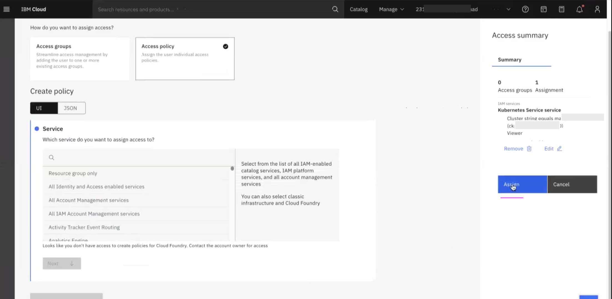

# Assigning Kubernetes Access to a User in IBM Cloud

This article explains about how to invite an user into IBM Cloud account and give access to one of the Kubernetes  service in that account.

1. Open the User management page by click on `Manage > IAM > Users`
2. Click on `Invite Users`

Invite users page is opened.
3. Select the `Access Policy` option

4. Type `Kub` in the search button
5. Select the `Kubernetes Service` option
6. Click on `Next`

7. Select values according to the below image.
8. In the `value` box choose the cluster name that you want to give access to.
9. Click on `Next`

8. Select the roles as per your need.
9. Click on `Review`

9. Click on `Add`

9. Click on `Invite`

User will be in  `Pending` state

User might have received mail from IBM cloud to join the account.

9. The user might click on `Join Now` link in the mail and join.

User will become `Active` state

10. Go to `Users > access` screen

You can able to see the Kubernetes service access  is available.

So we have invited an user along with an access  to one of the Kubernetes  service.

If required we can give access to one more cluster for the same user again.

9. Click on `Assign Access` to give one more service if you want.

9. Fill the values as per your need.

9. Fill the values as per your need.
10. Click on `Assign` to give an acess.

Now you can able to see the another Kubernetes service access  is available.

